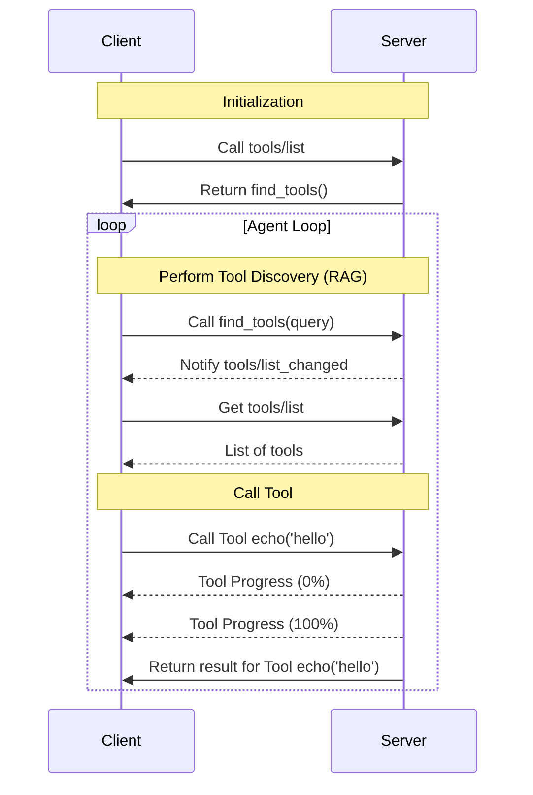

# Overview

## Architecture

## Protocol

```mermaid
sequenceDiagram
participant Client as Client
participant Server as Server

Note over Client, Server: Initialization
Client->>Server: Call tools/list
Server->>Client: Return find_tools()

loop Agent Loop
Note over Client, Server: Perform Tool Discovery (RAG)
Client->>Server: Call find_tools(query)
Server-->>Client: Notify tools/list_changed
Client->>Server: Get tools/list
Server-->>Client: List of tools


Note over Client, Server: Call Tool
Client->>Server: Call Tool echo('hello')
Server-->>Client: Tool Progress (0%)
Server-->>Client: Tool Progress (100%)
Server->>Client: Return result for Tool echo('hello')

end
```